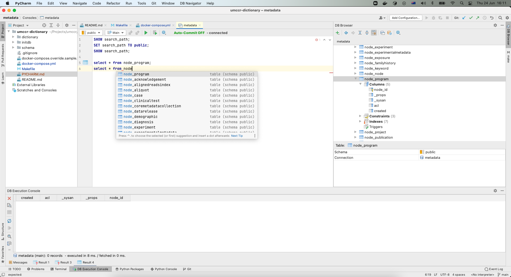
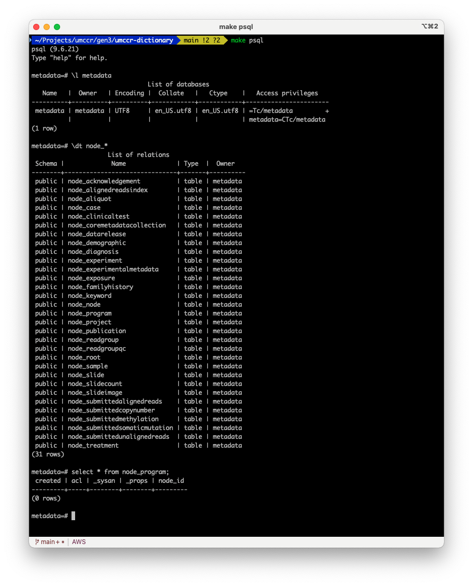

# UMCCR Data Dictionary

This repo contains Docker and Makefile based Data Dictionary Development workflow i.e., packaging around dictionary tools (Docker image) for conversion, visualisation, testing, validation to allow Data Modeller to iteratively develop schema locally. 

Our aim is to develop **UMCCR Data Dictionary** for Gen3 platform. 

## Development

### Design Notes

- Read [design_notes.md](https://github.com/uc-cdis/datadictionary/blob/develop/design_notes.md)
- Read [search-query.md](https://github.com/umccr/gen3-doc/blob/main/user-guide/search-query.md) for how metadata (in Graph) will get queried through GraphQL API. Hence, multiple Data Dictionary with single Gen3 instance is not possible.

### Context

How do I develop Gen3 Data Dictionary?

- Read pointers from this [FAQ](https://gen3.org/resources/faq/#data-dictionary).
- Gen3 Data Dictionary are essentially authored in YAML file as DSL (Domain-Specific Language). However, there are tools available from Excel/CSV/TSV to YAML to JSON conversion. So, to start with, it can be as simple as modelling in Excel for metadata requirement for Data Dictionary. i.e. to have rough idea on determining base entities (a node in a Graph), their attributes (node properties) and links (edge/relation). See [README.md](https://github.com/uc-cdis/datadictionary/blob/develop/README.md)
- Alternatively, you can pick the baseline dictionary that _closely_ suit for your need and work out from there. By default, this is the [GDC dictionary](dictionary/gdc). You can search around in **_uc-cdis_** repos, keywords such as:
  - [datadictionary](https://github.com/orgs/uc-cdis/repositories?q=datadictionary&type=&language=&sort=)
  - [data dictionary](https://github.com/orgs/uc-cdis/repositories?q=data+dictionary&type=&language=&sort=)
- Or, have a look:
  - http://mindset-gen3-gallery.s3-website-us-east-1.amazonaws.com
  - and, browse around [deployed sites](https://github.com/uc-cdis/cdis-manifest)

In this repo, we selected few data dictionaries in [dictionary folder](dictionary) to work with the following data dictionary development workflow.

### Prerequisite

- [Docker Desktop](https://www.docker.com/products/docker-desktop) (at least v3.2.1)
- [GNU Make](https://www.gnu.org/software/make/)
  - GNU Make comes with most Linux and macOS Xcode
  - Try `make --version` to see whether you already have it in   
  - Otherwise `brew install make` for macOS and try like `gmake --version`
  - On Ubuntu, try `apt-get install make`
  - If `make` is not possible then you will need to execute each target in [Makefile](Makefile)

## Workflow

### Basic

- Download all the latest images in the stack
```
make pull
```

- Bring up the stack
```
make up
```

- Check the stack
```
make ps
```

- Restart the stack 
```
make restart
```

- Bring it down 
```
make down
```

### Environment Variables

- By default, it uses `.env-sample` for PostgreSQL connection and credentials.
- You may override it by simply make a copy of file name in `.env` like so:

```
cp .env-sample .env
```

- You can then modify `.env` for your own custom values.
- This `.env` is ignored for GitHub.

> NOTE: You do not need to do this, if you are happy with default values in `.env-sample`. However, if you do, you need to `make down` and `make up` to take effect on changes.

### Visualising Dictionary

- Visit to: http://localhost:8080
- You can switch dictionary as follows:
  - `http://localhost:8080/#schema/<dictionary_name>.json` e.g.
  - http://localhost:8080/#schema/anvil.json
  - http://localhost:8080/#schema/dcf.json 
  - http://localhost:8080/#schema/gdc.json 
  - http://localhost:8080/#schema/kf.json

> DEBUG: To debug visualisation, try with Browser built-in developer tools (e.g., [here](https://balsamiq.com/support/faqs/browserconsole/) and [here](https://developer.chrome.com/docs/devtools/console/log/)). Typically, right click > inspect > select "console" tab > reload the page.

### Modifying Dictionary

- Say you are working on `umccr` dictionary
- Modify schema yaml files in `dictionary/umccr/gdcdictionary/schemas`
- Compile into JSON
```
make compile dd=umccr
make compile dd=kf
make compile dd=gdc
make compile dd=anvil
make compile dd=dcf
```
- Visit to: http://localhost:8080/#schema/umccr.json
- Reload the page (_**do twice**_ if necessary)


### Testing Dictionary

- To test and validate dictionary:
```
make test dd=umccr
```

### Validating Dictionary

- To validate DD graph, do like so:

```
make validate dd=umccr
```

### Generating Simulated Data

- To simulate test data for the _minted_ JSON Data Dictionary e.g., say `umccr` dictionary

```
make simulate dd=umccr
```

- This will validate the DD's graph and create test mock data into `/data/umccr/` folder.

### Loading Dictionary

- This will populate database schema tables into local PostgreSQL server; based on JSON Data Dictionary schema that you have designed from previous steps.

- To load the _minted_ JSON Data Dictionary to Gen3 Metadata Database tables e.g., say `umccr` dictionary

```
make load dd=umccr
```

### Importing Simulated Data

- To import simulated data based on `umccr` dictionary, do like so:
```
make import dd=umccr
```

- Part of data importing process, it also creates `*.tsv` counterpart of simulated `*.json` data. Please see [output/README.md](output/README.md) for more.

### Accessing Database Console

- Get into PSQL console

```
make psql
```

- Once inside PSQL console, try like so:

```
metadata=> \l
metadata=> \dt
metadata=> \dt node_*
metadata=> \dt edge_*

metadata=> \d node_program
                 Table "public.node_program"
 Column  |           Type           |       Modifiers
---------+--------------------------+------------------------
 created | timestamp with time zone | not null default now()
 acl     | text[]                   |
 _sysan  | jsonb                    | default '{}'::jsonb
 _props  | jsonb                    | default '{}'::jsonb
 node_id | text                     | not null

metadata=> select * from node_program;
metadata=> select * from node_project;

metadata=> \q
```

### Resetting Database

- The Data Dictionary is populated into [PostgreSQL Public schema](https://www.postgresql.org/docs/9.6/ddl-schemas.html)

- If you'd like to reset public schema, do like so:
```
make reset
```

- This will reset current `metadata` database; so that you can (re) load data dictionary again. Hence, for example:

```
make load dd=umccr
make psql
metadata=> \dt node_*
metadata=> \q

make reset

make load dd=anvil
make psql
metadata=> \dt node_*
metadata=> \q
```

### Connection Info

- At this point, you have a couple of options to work with local PostgreSQL database. Use connection info as follows:
```
Host: localhost
Port: 5432
Database: metadata
Username: metadata
Password: metadata
```

- For sa (System Admin) account; use these instead:
```
Host: localhost
Port: 5432
Database: metadata
Username: postgres
Password: postgres
```

#### PSQL

If you are new to PSQL, try the following for starter:

- http://postgresguide.com/utilities/psql.html
- https://www.postgresqltutorial.com/psql-commands/  
- https://www.postgresqltutorial.com

#### Database Tooling

- Try the following for some GUI-based IDE tooling:
  - Setup [PyCharm Community Edition](PYCHARM.md)
  - [SQL Developer](https://www.oracle.com/tools/downloads/sqldev-downloads.html) (freeware)

**Screenshot:** _PyCharm_



**Screenshot:** _PSQL Console_


